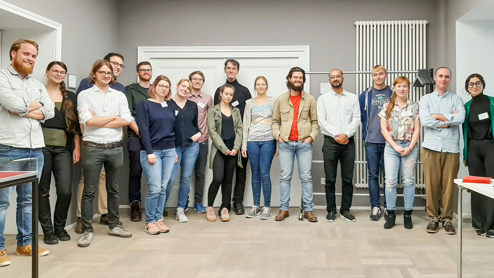

The second Düsseldorf Graduate Workshop for Philosophy discussed questions such as: How do people imagine alternatives to reality? What role plays imagination in counterfactual reasoning? Is imagination a guide to possibility? Can we imagine impossibilities? What is the relationship between imagination and other mental states?

The workshop was organized by Till Gallasch (Würzburg), Paul Hasselkuß (Düsseldorf), Sara Ipakchi (Düsseldorf) and Jessica Struchhold (Duisburg-Essen). It was generously supported by the [Faculty of Arts and Humanities](http://www.philo.hhu.de/en.html), Heinrich-Heine University, the [German Society for Analytic Philosophy](https://www.gap-im-netz.de/en/), and by [Prof. Dr. Markus Schrenk](https://www.philosophie.hhu.de/en/staff/philosophy-iii-metaphysics-and-philosophy-of-language/markus-schrenk) (Düsseldorf) of the DFG Research Group [Inductive Metaphysics](https://indmet.weebly.com/) (FOR2495).

